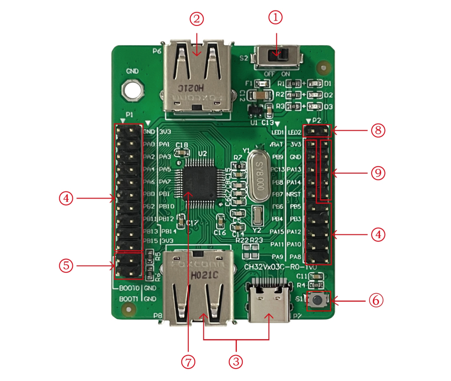

# notes
 - svd file from MounRiverStudio 
   template/wizard/WCH/RISC-V/CH32V203/NoneOS/
   folder
 - `cmake/riscv.cmake` file inspired from ch33funthingy TODO: correct attribution

## openocd
 - https://github.com/kprasadvnsi/riscv-openocd-wch 
 - fork from MounRiver  

## Evaluation Examples
 - download and search from wch website
 
 - CH32V20xEVT.ZIP
 - CH32V003EVT.ZIP

## toolchain
 - MRS_Toolchain_Linux_X64_V170.tar.xz
 - contains openocd mentioned above and riscv gcc v8.x from manufacturer


## Moun River IDE
 - official WCH IDE
 - MounRiver_Studio_Community_Linux_x64_V140.tar.xz
 - contains templates/examples for the chips,
 - svd files for cortex-debug

## used VSCode extensions
 - C/C++
 - C/C++ Extension Pack
 - Cortex-debug

##  usage
 1. extract contents from `MRS_Toolchain_Linux_X64_V170.tar.xz/RISC-V Embedded GCC`
    to `toolchian/gcc`
 2. extract contents from `MRS_Toolchain_Linux_X64_V170.tar.xz/OpenOCD` to `toolchain/openocd`
 2. copy udev rules for wch-link from `MRS_Toolchain_Linux_X64_V170.tar.xz/beforeinstall/60-openocd.rules`
 3. in terminal source `scripts/activate.sh`
 4. open demo project from terminal:
    ```
    $> code demo_CH32V...
    ```
 5. cmake configure through vscode or terminal as usual

## SWD Debug Pinning:

### CH32V003
 

#### Header 7:
 
- PD1 -> SWDIO
#### HEADER 6:
- PC1 -> LED1
- PC2 -> LED2

### CH32203
 

#### Header 9:
- PA13 -> SWDIO 
- PA14 -> SWCLK
#### HEADER 4, 8:
- PB0 -> LED1
- PB1 -> LED2
